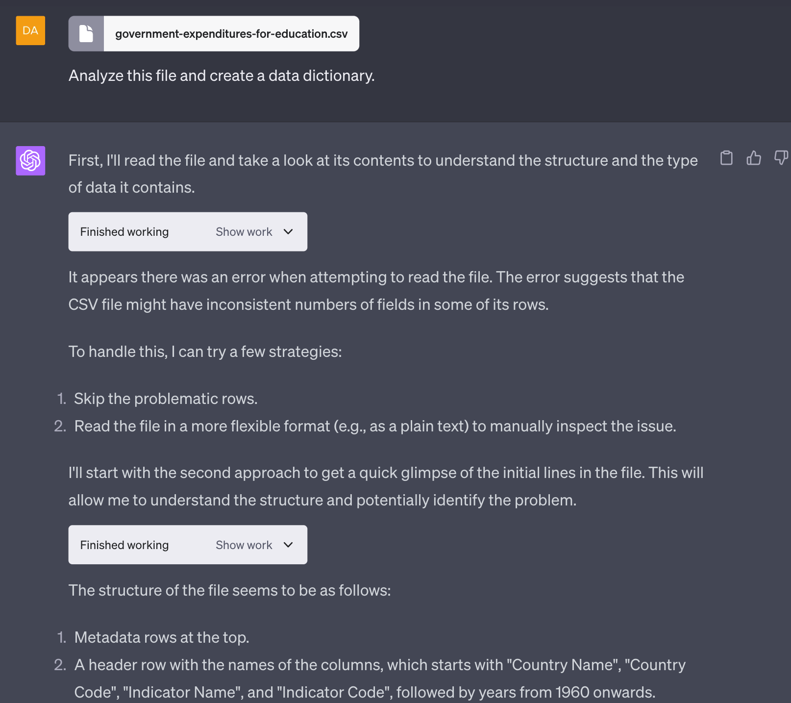

# Data Analysis

In this lesson, we will use data from the World Bank to look at the corrolation between expenditure on education and literacy rates for different countries around the world.

Here is our process:

1. Don't look at the data files.  Just have ChatGPT figure out the data formats.
2. Ask ChatGPT to create a data dictionary for each input file
3. Ask ChatGPT to create a 2D scatter plot with a point for each country
4. Ask ChatGPT to *"Find any insights in this data?"*
5. Then ask ChatGPT to look for root causes of the patterns in the data
6. Ask ChatGPT to suggest ways that countries can improve the effectiveness of their spending on education
7. Finally, ask ChatGPT to suggest how countries could improve computer literacy

## Load CSV Files And Build a Data Dictionary

Prompt


## Computer Literacy

### Prompt

```linenums="0"
What about computer literacy?  How can countries spend wisely to make sure that their students become computer literate?
```

### Response

Computer literacy, in today's digital age, is fundamental for personal and professional development. Ensuring students are computer literate requires not just investment in infrastructure but also in curriculum development, teacher training, and fostering an environment of digital inclusivity. Here are some strategies and policies countries can pursue to spend wisely on promoting computer literacy:

1. **Infrastructure Investment**: 
   - **Affordable Devices**: Procure cost-effective computing devices for schools. Consider devices like tablets or Chromebooks, which can be more affordable than traditional PCs.
   - **Reliable Internet Access**: Ensure schools have reliable and fast internet connectivity. This is essential for accessing online resources and cloud-based applications.

2. **Curriculum Integration**:
   - **Age-Appropriate Introduction**: Introduce computer literacy from an early age, with content appropriate for each grade level.
   - **Incorporate Coding**: Introduce basic coding and computational thinking as part of the curriculum. Tools like Scratch make this accessible even for younger students.

3. **Teacher Training**:
   - **Professional Development**: Regularly train teachers in the latest digital tools and educational technologies.
   - **Hire Specialists**: Consider hiring computer science or IT specialists for advanced courses at higher grade levels.

4. **Public-Private Partnerships**:
   - Collaborate with tech companies for software licenses, hardware donations, or even training programs. Many companies have initiatives aimed at promoting computer literacy in schools.

5. **Online Learning Platforms**:
   - Use online platforms and resources, such as Khan Academy, Codecademy, or Coursera, which offer courses in computer science and programming.

6. **Inclusive Digital Education**:
   - Ensure that digital education resources are accessible to students with disabilities. This includes screen readers, adaptive keyboards, and other assistive technologies.

7. **Safe and Responsible Use**:
   - Along with computer literacy, teach students about cyber safety, digital etiquette, and the responsible use of technology.

8. **Community Engagement**:
   - Organize community tech days or hackathons where students can showcase their digital projects. This not only promotes computer literacy but also fosters a community spirit around digital innovation.
   - Engage with local tech communities or groups for mentorship programs.

9. **Continuous Evaluation**:
   - Regularly assess the computer literacy levels of students to identify areas of improvement.
   - Update the curriculum and teaching methods based on evolving technological trends.

10. **Open Source Tools**:
   - Utilize open-source software, which can be a cost-effective way to introduce students to a wide range of applications without the burden of licensing fees.

11. **Digital Libraries and Labs**:
   - Set up digital labs or resource centers where students can access computers and digital resources after school hours.

12. **Foster a Culture of Creativity**:
   - Encourage students to use technology not just for consumption but for creation. This can be through digital art, coding projects, website design, or any other creative endeavor.

13. **Feedback Mechanisms**:
   - Implement feedback systems where students and teachers can provide insights into the effectiveness of computer literacy programs.

14. **Benchmark and Collaborate**:
   - Benchmark against countries with successful computer literacy programs.
   - Collaborate internationally to share resources, training programs, and best practices.

By integrating computer literacy seamlessly into the broader educational framework and ensuring that investments are made in both hardware and human capacity building, countries can ensure that their students are well-prepared for the digital age.
