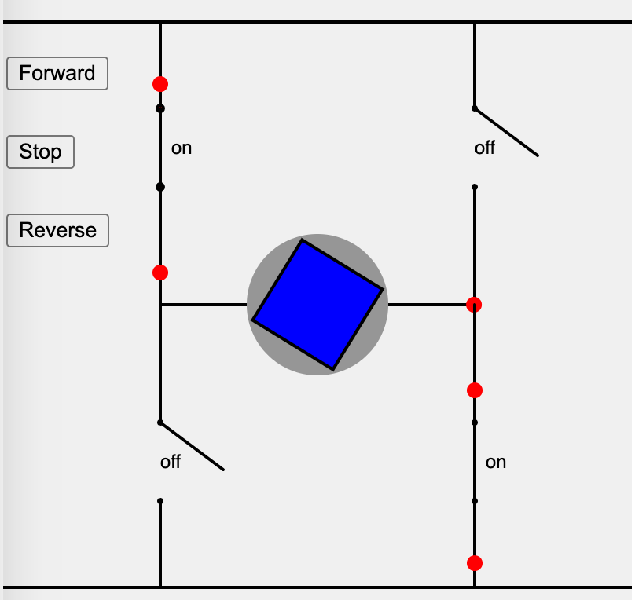

# H-Bridge Circuit

An H-bridge circuit is four switches around a motor in the shape of the letter "H".
The motor is at the center of the letter "H".
When the upper-left and lower-right switches are closed, the motor spins one direction.
When the lower-left and upper-right switches are closed, the motor spins in the opposite direction.



[H-Bridge Demo](./h-bridge.html)

```linenums="0"
Generate a single p5.js sketch file.

Draw an H-bridge circuit for reversing the direction of a DC motor.

Have three state buttons for "Forward", "Stop" and "Reverse".
Place the positive power rail at the top of the circuit.
Place the negative rail at the bottom of the circuit.
Place the motor in the center of the H-brige ciricut.
Animate the motor moving clockwise for the Forward state.
Animate the motor going counter-clockwise for the Reverse state.
Make the motor stopped for the Stop state.
Have the upper left and lower right wires animate current for the Forward state.
Have the upper right and lower left wires animate current for the Reverse state.
Turn off all wire animation for the Stop state.

Create four knife switches.
Have the upper left and lower right be closed for Forward.
Have the upper right and lower left be closed for Reverse.
Have all the switches be open for Stop.

Use the following function to draw current in a wire:

function drawAnimatedWire(x1, y1, x2, y2, speed1, state) {
    if (state) {
        let distance = dist(x1, y1, x2, y2);
        let circlePos = map((millis() * speed1) % distance, 0, distance, 0, 1);

        // lerp generates the percent between two values
        let x = lerp(x1, x2, circlePos);
        let y = lerp(y1, y2, circlePos);

        stroke(0);
        strokeWeight(lineWidth)
        line(x1, y1, x2, y2); // Draw the wire

        fill(255, 0, 0);
        noStroke();
        circle(x, y, 10); // Draw the moving circle (electron)
    } else {
        stroke(0);
        strokeWeight(lineWidth)
        line(x1, y1, x2, y2); // Draw the wire
    }
}
```
## Response

Sure! Here's a p5.js sketch file that implements the H-bridge circuit with state buttons for "Forward," "Stop," and "Reverse":

```js
let forwardButton;
let stopButton;
let reverseButton;

const lineWidth = 2;

function setup() {
  createCanvas(400, 400);
  
  forwardButton = createButton('Forward');
  forwardButton.position(10, 10);
  forwardButton.mousePressed(forward);

  stopButton = createButton('Stop');
  stopButton.position(90, 10);
  stopButton.mousePressed(stop);

  reverseButton = createButton('Reverse');
  reverseButton.position(150, 10);
  reverseButton.mousePressed(reverse);
}

function forward() {
  // Code to control the H-bridge for forward motion
}

function stop() {
  // Code to stop the motor
}

function reverse() {
  // Code to control the H-bridge for reverse motion
}

function draw() {
  background(220);

  // Draw positive power rail
  stroke(0);
  strokeWeight(lineWidth);
  line(40, 60, width - 40, 60);

  // Draw negative power rail
  stroke(0);
  strokeWeight(lineWidth);
  line(40, height - 60, width - 40, height - 60);

  // Draw H-bridge circuit
  stroke(0);
  strokeWeight(lineWidth);
  line(width / 2 - 40, 60, width / 2 - 40, height - 60);
  line(width / 2 + 40, 60, width / 2 + 40, height - 60);
  line(width / 2 - 40, height / 2, width / 2 + 40, height / 2);

  // Draw motor
  noFill();
  stroke(0);
  strokeWeight(lineWidth);
  rect(width / 2 - 20, height / 2 - 20, 40, 40);

  // Draw wires with current
  let speed1 = 0.01;
  drawAnimatedWire(40, 60, width / 2 - 40, 60, speed1, forwardButton.elt.disabled);
  drawAnimatedWire(width / 2 + 40, 60, width - 40, 60, speed1, reverseButton.elt.disabled);
  drawAnimatedWire(40, height - 60, width / 2 - 40, height - 60, speed1, reverseButton.elt.disabled);
  drawAnimatedWire(width / 2 + 40, height - 60, width - 40, height - 60, speed1, forwardButton.elt.disabled);
}

function drawAnimatedWire(x1, y1, x2, y2, speed1, state) {
  if (state) {
    let distance = dist(x1, y1, x2, y2);
    let circlePos = map((millis() * speed1) % distance, 0, distance, 0, 1);

    // lerp generates the percent between two values
    let x = lerp(x1, x2, circlePos);
    let y = lerp(y1, y2, circlePos);

    stroke(0);
    strokeWeight(lineWidth);
    line(x1, y1, x2, y2); // Draw the wire

    fill(255, 0, 0);
    noStroke();
    circle(x, y, 10); // Draw the moving circle (electron)
  } else {
    stroke(0);
    strokeWeight(lineWidth);
    line(x1, y1, x2, y2); // Draw the wire
  }
}
```


