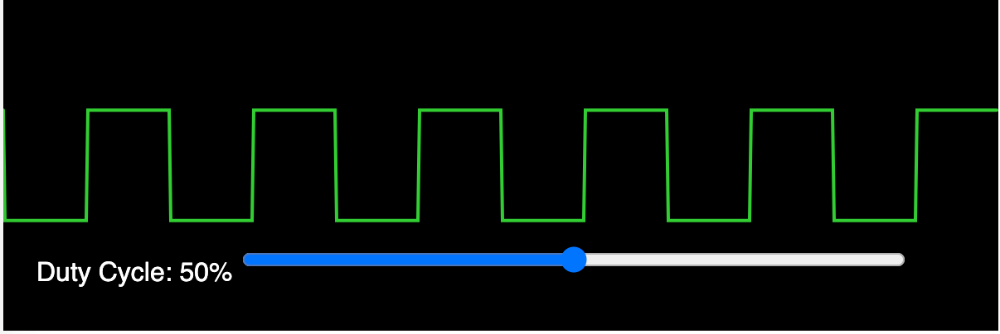
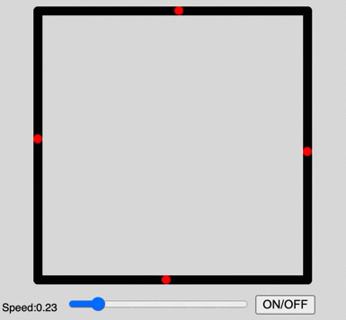
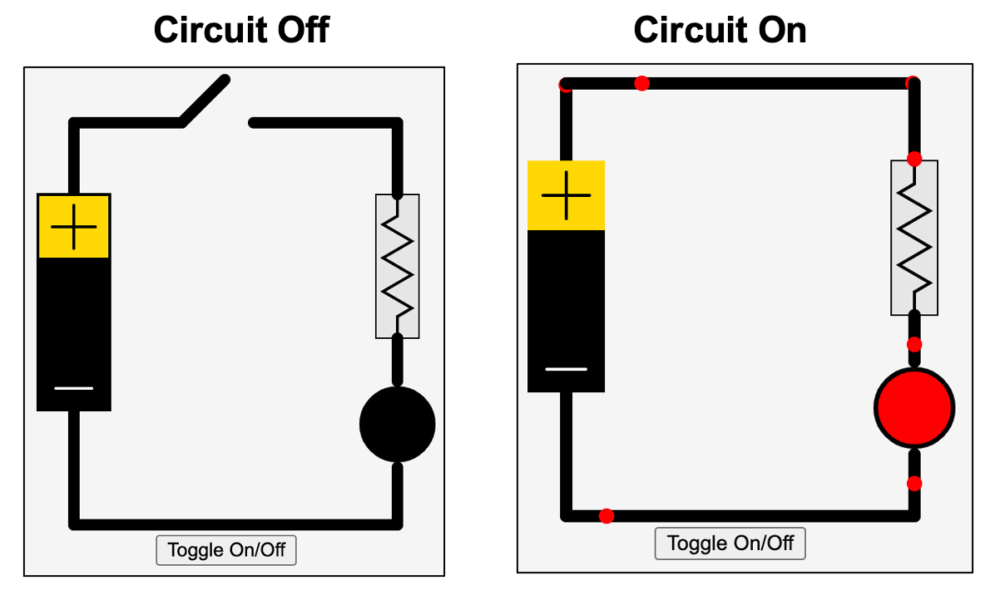

# Processing Examples

All of these [p5.js](https://p5js.org/) examples were inspired by the wonderful [Val Lockhart](https://www.linkedin.com/in/valockhart/) and [Troy Peterson](https://www.linkedin.com/in/troyapeterson/).  They were the
first to get the idea to generate p5.js code using ChatGPT.

If you are not familiar with p5.js, it is a high-quality JavaScript library for building interactive animations.  It has been around since 2014 and it is supported by a large community of educators and creative people that combine programming with art.  Because there is a strong ethos of sharing open-source p5.js scripts there is ample material for ChatGPT to be trained on.  There are currently over [21,000 p5.js sketches](https://github.com/search?q=p5.js&type=repositories) found on GitHub!

Our goal here is to teach you how to write precise ChatGPT prompts that will generate a working p5.js simulation without having to understand how to write JavaScript.

## Structure of a p5.js Sketch

Each sketch (the name of a p5.js program) is usually a single JavaScript file that has an extension of .js.
It has two main functions:

1. ```setup()``` - which is run once on sketch startup.
2. ```draw()``` - which run continually with a default redraw interval of 60 frames per second.

A sketch runs in an area called a ```canvas``` which typically has a size such as 400x400.

## Prompting Tips

My suggestion is to always start your p5.js prompts with a statement such as:

*Generate a single file p5.js sketch on a 400x400 canvas.*


ChatGPT is very good at generating algorithms, but it is not good at doing layout.  This is also compounded
by the fact that many programs are designed to draw on a cartesian coordinate system with the origin being
placed in the lower left corner of a canvas.  Unfortunately, p5.js (like other HTML rendering tools) assumes that the origin is in the upper right corner of the screen.  This causes ChatGPT to get confused and requires us to flip our diagrams on the y-axis by hand.  See [p5.js Coordinates](https://p5js.org/examples/structure-coordinates.html) and [The p5.js Coordinate System and Shapes](https://p5js.org/learn/coordinate-system-and-shapes.html) for some details.

Here are some of my tips.

### Range Control Sliders

{: style="height:300px;width:300px"}

Sliders are the input range controls that allow users to change a value of a simulation.  I use
sliders extensively in my examples because they are visible and intuitive.  To get the sliders to work you need to give ChatGPT clear instructions to include both the slider, its label and its current value in the program.

Note that many p5.js examples don't use sliders, but they use a mouse position on the canvas.  This is
usually a poor design choice since there is no clear hints the simulation us using the values and there
is no label or feedback on what the current value is.

Sliders have the following properties:

1. Their initial position (x and y)
2. Their min and max values
3. The default value
4. The step or increment (default is 1)
5. The width of a slider

See the [p5.js createSlider](https://p5js.org/reference/#/p5/createSlider) page for details.

Unfortunately, there is no simple way to change many of the display details such as drawing the tick marks on a range control and changing the color.

Here are two examples.

#### Simple Slider with Label and Value
Here is some sample text you can give ChatGPT to precisely create and position sliders.

**ChatGPT Prompt:**

```linenums="0"
Add a slider that controls the radius at the bottom of the canvas.
The slider has values that ranges from 0 to 200 with a default value of 100.
Place the slider to the right of the slider label and value at the bottom of the canvas.
Place a label of "Radius:" and the current radius value using text() at the end of the draw() function.
```

Here is the full prompt:

```linenums="0"
Generate a single file p5.js sketch on a 400x400 canvas.

The sketch will draw a blue circle at the center of the canvas.

Add a slider that controls the radius of the circle at the bottom of the canvas.
The slider has values that ranges from 0 to 200 with a default value of 100.
Place the slider at the bottom of the canvas.
Place a label of "Radius:" and the current radius value using text() at the end of the draw() function.
```

[Demo of Single Slider Radius Example](./slider.html)

#### Multiple Slider Example

Our simulations sometimes have multiple parameters that the user can change.  But how can we make the sliders
align correctly?
The trick here is to get ChatGPT to lay out the sliders correctly at the bottom of the canvas with the label, value and sliders aligned.

**ChatGPT Prompt:**
```linenums="0"
Generate a single file p5.js sketch on a 400x400 canvas.

The sketch draws a green rectangle at (100,100).

Add two sliders placed on the bottom of the canvas to the right of the labels and values.

One slider controls the height of a rectangle and one slider controls
the width of the rectangle.  The labels are "Height:" and "Width:".  The values are placed
to the right of the labels.

Place both the slider labels and their values to the left of the sliders.

Make the sliders widths span the remaining width of the canvas after the label and values.
```

[Two Sliders Controlling a Rectangle](./sliders.html)

Note that you might have to manually adjust the placement of the labels, values and sliders and change width of the sliders to get the alignment correct.  Element layout is not a strength of ChatGPT.

### Sketch Container Placement

ChatGPT is not really good at placing graphic components on the screen and placing the canvas so it renders well within an HTML file.  We focus on just getting ChatGPT to generate the correct sketch and then we place
the sketch within an HTML file.  Here is an example of placing a canvas within an HTML table.


To do this, within the ```setup()``` function we can use the ```canvas.parent()``` method to indicate the ID of the enclosing HTML div id.  Here is some sample ```setup()`` code:

```js
function setup() {
  // Create a p5.js canvas inside the div with id "sketch-container"
  const canvas = createCanvas(400, 400);
  canvas.parent('sketch-container');
}
```

See the [p5.js parent](https://p5js.org/reference/#/p5.Element/parent) reference document.

[Container Placement Example](./container-placement.html)

## Basic Examples

### Circle Slider

Here is a simple example that you can start with.  The ChatGPT prompt would be the following:

```linenums="0"
Generate a p5.js sketch file that draws a blue circle
in the center of a 400x400 canvas.

Create a range control slider that allows the radius to be
adjusted from 0 to 200.

Use the text() function within the draw() function to display the
label and current value of the radius.
```

[Circle Slider](./circle-slider.html)

```javascript
let radiusSlider;
let radius = 0;

function setup() {
  createCanvas(400, 400);
  
  // Create the radius slider
  radiusSlider = createSlider(0, 200, 100);
  radiusSlider.position(10, 10);
}

function draw() {
  background(220);
  
  // Fetch the current radius from the slider
  radius = radiusSlider.value();

  // Draw the circle
  fill(0, 0, 255);
  noStroke();
  circle(width / 2, height / 2, radius * 2);

  // Display the radius value
  fill(0);
  text("Radius: " + radius, 10, 50);
}
```

### Polygon

In this example, we will use a more detailed prompt to control the placement of the
sliders and their values.

Prompt:
```linenums="0"
Generate a p5.js sketch file that draws filled polygons on a 400x400 canvas.

Create one range control slider that allows the color inside the polygon
to be changed to any color.  Make the default value be 170 (blue).

Create second range control slider that allows the number of points on
the polygon to vary from 3 to 10 in steps of 1.  Make the default be 10.

Make the sliders be the width of the canvas.  Place the sliders at the bottom
of the canvas 100 points in from the left.

Use the text() function at the end of the draw() function to display the
name and current values of the sliders.
```

[Polygon Demonstration](./polygon.html)

### Multi-pointed Star

Here is a p5 sketch that generates a multi-pointed star.  

[Multi-pointed Star](./star.html)

Here is the prompt I used to generate
this program.

```linenums="0"
Generate a p5.js sketch that draws a star at the center of a 400x400 canvas. 
Add a slider for the number of points on the star that ranges from 4 to 20. 
Make the slider width be 360px and display the number of points by using the
text() function at the end of the draw() function.
```
### Rainbow Tree

Generating a fractal tree is a fun way to demonstrate recursion.

[Rainbow Tree](./rainbow-tree.html)

### Slope and Intercept

Students that are learning charts and plotting will learn about the slope and intercept of a line.
This one is tricky since processing uses the upper-left corner as the origin and y increases as
we move down the page.</br>

[Slope and Intercept](./slope.html)

[Supply and Demand](./supply-and-demand.html)

### Sine Wave

In this demo, we use three range controls to change the amplitude, period and phase of a sine wave.

[Sine Wave Demo](./sine.html)

### Wave Sums

This lab demonstrates calculating the sum of different sine waves.

[Wave Sums](./wave-sums.html)

### Pulse-Width Modulation



Pulse-width modulation is the way that microcontrollers send a precise signal to a devise such as a motor controller.  This simulation models an old CRT oscilloscope display.

[Pulse-Width Modulation](./pwm.html)

### Brownian Motion

A classic physics simulation where the user can adjust the temperature and number of molecules in the simulation.

[Brownian Motion](./brownian-motion.html)

### Conway's Game of Life

[Conway's Game of Life](https://en.wikipedia.org/wiki/Conway%27s_Game_of_Life) is a simple simulator of cells.  This is a class of simulation called [Cellular Automata](https://en.wikipedia.org/wiki/Cellular_automaton)

[Conway's Game of Life](./conways-life.html)

### Wire Animation



When animating circuits, we need an animation of electrons moving down a wire.  In
this lesson, we use ChatGPT to generate a function to help us
draw a wire that has an animation of small circles (think electrons) going through the wire
when the wire is carrying a current.

Requesting ChatGPT to generate an explicit function is a great way to break larger
problems into smaller tasks that ChatGPT can be successful at.

[Run the Wire Animation Demo](./wire-animate.html)

### Battery and LED Circuit



This is the most complex program we have generated so far.  It requires us
to first use ChatGPT to create several functions:

1. A drawBattery function
2. A drawSwitch function that will toggle on or off
3. A resistor function that draws a resistor zig-zag symbol
4. An LED function that is black in the off state and red in the on state
5. An animate wire function that animates the flow of current (see the previous example)

Once we have functions for all these components, we can then assemble them together in
an entire simulation.  You will find that ChatGPT will not usually get the the layout
wrong and you will need to adjust the positions of the wires.

[Battery and LED Circuit](./battery-circuit.html)

### Virus Simulation

A classic simulation of the rate that a virus spreads in a network.<br/>
[Virus Simulation](./virus-sim.html)
TODO - use a force-directed graph to rearrange the network.

### Sierpinski Fractal Triangle

[Sierpinski Fractal Triangle](./sierpinski.html)

### Koch Fractal Curve

[Koch Fractal Curve](./koch-fractal-curve.html)

### Rabbit and Foxes

Simulate foxes eating rabbits. <br/>

[Rabbit and Foxes](./rabbit-and-foxes.html)

### Projectile Motion

[Canon Simulator](./canon.html)

### Mass on A Spring

This is a simulator of a mass on the end of a coiled spring.

The user can change:

1. The mass amount (M)
2. The spring constant (K)
3. The damping factor (D)

[Spring Simulator](./spring.html)

The simulation still needs some UX work.  The drag-down operation is not clean and the spring could
be compressed more.

### Simple Maze Runner

A simple grid layout of a maze and a mouse that can only move right or down.

[Simple Maze Runner](./simple-maze.html)

### Maze Generator

This sample program was not created by ChatGPT but it demonstrates an algorithm for generating maze diagrams.

Videos
1. [Coding Challenge #10.1: Maze Generator with p5.js - Part 1](https://youtu.be/HyK_Q5rrcr4)
2. [Coding Challenge #10.2: Maze Generator with p5.js - Part 2](https://youtu.be/D8UgRyRnvXU)
3. [Coding Challenge #10.3: Maze Generator with p5.js - Part 3](https://youtu.be/8Ju_uxJ9v44)
4. [Coding Challenge #10.4: Maze Generator with p5.js - Part 4](https://youtu.be/_p5IH0L63wo)

[Depth-first search Recursive backtracker Wikipedia Page](https://en.wikipedia.org/wiki/Maze_generation_algorithm)


[Maze Generator](./maze-gen/maze-gen.html)

## To Dos

Here is a list of small animations that I have yet to do:

1. EE - Simple circuits - battery, switch and light
2. EE - Current measurement - measure the current in an LED circuit
3. EE - H-Bridge - how to make a motor turn both forward and reverse using switches
4. EE - Pulse-Width Modulation - how to send information from a microcontroller to a motor driver indicating the speed of a motor and the direction of a motor.
5. EE - RGB LEDs - make any color by combining red, green a blue LEDs
6. EE - LED Circuit
7. EE - Distance sensor
8. Robotics - Collision avoidance
9. Robotics - Maze solving
10. Robotics - Digital compass
11. EE - Seven-segment display
12. EE - Alphanumeric display
13. EE - Character display (2 rows by 40 characters)
14. EE - LED bar display
15. EE - Addressable LED strip simulator
16. EE - Physical computing - Microcontrollers, sensors, actuators, displays
17. Robotics - Swarm robots
18. EE - Color displays from red, green and blue LEDs
19. Network science - vertices and edge counts - network complexity
20. Network science - average degree
21. Network science - in-degree and out-degree
22. Network science - directed and undirected graphs
23. Network science - acyclic graphs
24. Network science - local communities
25. Network science - traveling salesperson
26. Machine learning - self-driving car
27. Robot arms - degrees of freedom
28. Simple gears
29. AI - perceptron
30. AI - bias and weights
31. AI - activation functions
32. AI - neural network
33. AI - deep neural network
34. AI - network complexity - parameter counting
35. CS - bits, bytes and words
36. CS - data types: strings, bytes, decimals and floats
37. CS - data structures - lists, sets, arrays
38. CS - sorting
39. CS - recursion

## Tutorials

* [p5.js Learn](https://p5js.org/learn/)

* [p5.js wiki](https://github.com/processing/p5.js/wiki)

* [Tool on Codecademy.com](https://www.codecademy.com/learn/learn-p5js/modules/p5js-introduction-to-creative-coding/cheatsheet)

## Other Examples

[oscillation sandbox](https://ffd8.github.io/oscillation-sandbox/)