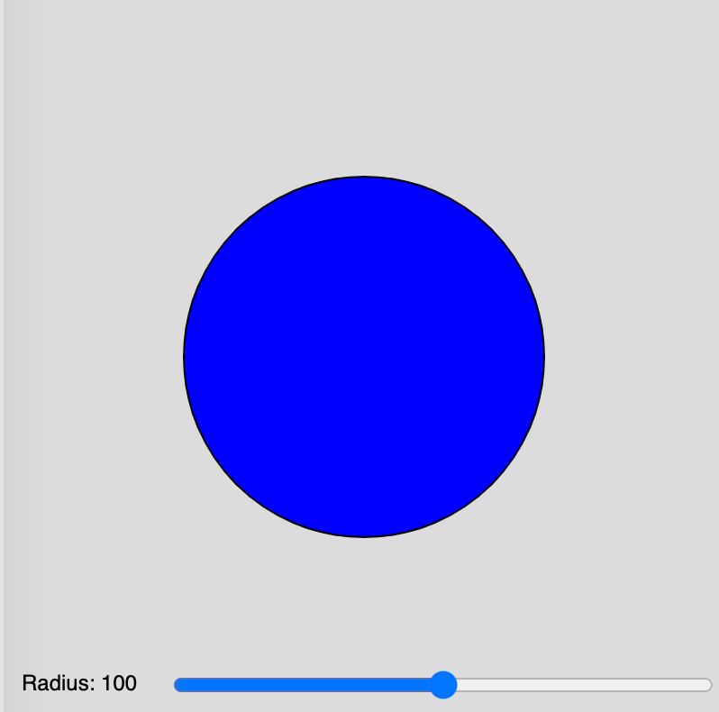
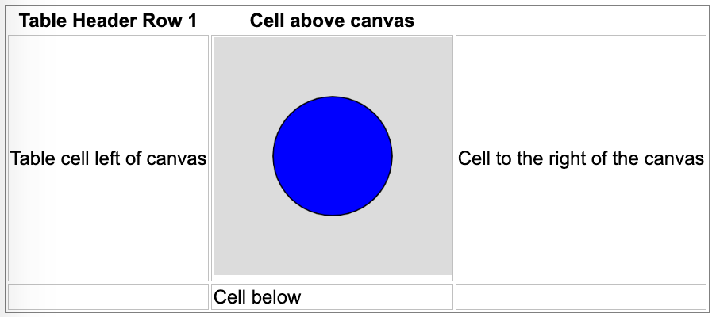

# Processing Examples

All of these examples were inspired by the wonderful Val Lockhart and Troy Peterson.  They were the
first to get the idea to generate Processing code from ChagGPT.

## Prompting Tips

Unlike popular languages like Python, there are not a lot of high-quality p5.js simulations available.
So ChatGPT has to guess based on the examples it found online.  Here are some of my tips.

### Sliders

{: style="height:300px;width:300px"}

Sliders are the input range controls that allow users to change a value of a simulation.  To get the sliders to work you need to give ChatGPT some sample code like the code below.

1. A single slider on a 400x400 canvas with label and text value. This demo
controls the radius of a circle.<br/>
[Single Slider Radius](./slider.html)

1. Two sliders on a 400x400 canvas that control the width and height of a rectangle.
<br/>
[Two Sliders Controlling a Rectangle](./sliders.html)

### Sketch Container Placement



ChatGPT is not really good at placing graphic components on the screen and placing the canvas so it renders well within an HTML file.

In the ```setup()``` function we can use the ```canvas.parent()``` method to indicate the ID of the enclosing HTML div id.

```js
function setup() {
  // Create a p5.js canvas inside the div with id "sketch-container"
  const canvas = createCanvas(400, 400);
  canvas.parent('sketch-container');
}

function draw() {
  background(220);
  // Your drawing code goes here
}
```

See the [p5.js parent](https://p5js.org/reference/#/p5.Element/parent) reference document.

[Container Placement Example](./container-placement.html)

## Basic Examples

### Circle Slider

Here is a simple example that you can start with.  The ChatGPT prompt would be the following:

```linenums="0"
Generate a p5.js sketch file that draws a blue circle in the center of a
400x400 canvas.  Create a range control slider that allows the radius
to be adjusted from 0 to 200.  Use the text() function within the draw()
function to display the current value of the radius in the canvas.
```

[Circle Slider](./circle-slider.html)

```javascript
let radiusSlider;
let radius = 0;

function setup() {
  createCanvas(400, 400);
  
  // Create the radius slider
  radiusSlider = createSlider(0, 200, 100);
  radiusSlider.position(10, 10);
}

function draw() {
  background(220);
  
  // Fetch the current radius from the slider
  radius = radiusSlider.value();

  // Draw the circle
  fill(0, 0, 255);
  noStroke();
  circle(width / 2, height / 2, radius * 2);

  // Display the radius value
  fill(0);
  text("Radius: " + radius, 10, 50);
}
```

### Polygon

In this example, we will use a more detailed prompt to control the placement of the
sliders and their values.

Prompt:
```linenums="0"
Generate a p5.js sketch file that draws filled polygons on a 400x400 canvas.

Create one range control slider that allows the color inside the polygon
to be changed to any color.  Make the default value be 170 (blue).

Create second range control slider that allows the number of points on
the polygon to vary from 3 to 10 in steps of 1.  Make the default be 10.

Make the sliders be the width of the canvas.  Place the sliders at the bottom
of the canvas 100 points in from the left.

Use the text() function at the end of the draw() function to display the
name and current values of the sliders.
```

[Polygon Demonstration](./polygon.html)

### Multi-pointed Star

Here is a p5 sketch that generates a multi-pointed star.  

[Multi-pointed Star](./star.html)

Here is the prompt I used to generate
this program.

```linenums="0"
Generate a p5.js sketch that draws a star at the center of a 400x400 canvas. 
Add a slider for the number of points on the star that ranges from 4 to 20. 
Make the slider width be 360px and display the number of points by using the
text() function at the end of the draw() function.
```

### Slope and Intercept

Students that are learning charts and plotting will learn about the slope and intercept of a line.
This one is tricky since processing uses the upper-left corner as the origin and y increases as
we move down the page.</br>

[Slope and Intercept](./slope.html)

[Supply and Demand](./supply-and-demand.html)

### Sine Wave

In this demo, we use three range controls to change the amplitude, period and phase of a sine wave.

[Sine Wave Demo](./sine.html)

### Wave Sums

This lab demonstrates calculating the sum of different sine waves.

[Wave Sums](./wave-sums.html)

### Brownian Motion

A classic physics simulation where the user can adjust the temperature and number of molecules in the simulation.

[Brownian Motion](./brownian-motion.html)

### Conway's Game of Life

[Conway's Game of Life](https://en.wikipedia.org/wiki/Conway%27s_Game_of_Life) is a simple simulator of cells.  This is a class of simulation called [Cellular Automata](https://en.wikipedia.org/wiki/Cellular_automaton)

[Conway's Game of Life](./conways-life.html)

### Virus Simulation

A classic simulation of the rate that a virus spreads in a network.<br/>
[Virus Simulation](./virus-sim.html)
TODO - use a force-directed graph to rearrange the network.

### Sierpinski Fractal Triangle

[Sierpinski Fractal Triangle](./sierpinski.html)

### Koch Fractal Curve

[Koch Fractal Curve](./koch-fractal-curve.html)

### Rabbit and Foxes

Simulate foxes eating rabbits. <br/>

[Rabbit and Foxes](./rabbit-and-foxes.html)

### Projectile Motion

[Canon Simulator](./canon.html)

### Mass on A Spring

This is a simulator of a mass on the end of a coiled spring.

The user can change:

1. The mass amount (M)
2. The spring constant (K)
3. The damping factor (D)

[Spring Simulator](./spring.html)

The simulation still needs some UX work.  The drag-down operation is not clean and the spring could
be compressed more.

## To Dos

Here is a list of small animations that I have yet to do:

1. EE - Simple circuits - battery, switch and light
2. EE - Current measurement - measure the current in an LED circuit
3. EE - H-Bridge - how to make a motor turn both forward and reverse using switches
4. EE - Pulse-Width Modulation - how to send information from a microcontroller to a motor driver indicating the speed of a motor and the direction of a motor.
5. EE - RGB LEDs - make any color by combining red, green a blue LEDs
6. EE - LED Circuit
7. EE - Distance sensor
8. Robotics - Collision avoidance
9. Robotics - Maze solving
10. Robotics - Digital compass
11. EE - Seven-segment display
12. EE - Alphanumeric display
13. EE - Character display (2 rows by 40 characters)
14. EE - LED bar display
15. EE - Addressable LED strip simulator
16. EE - Physical computing - Microcontrollers, sensors, actuators, displays
17. Robotics - Swarm robots
18. EE - Color displays from red, green and blue LEDs
19. Network science - vertices and edge counts - network complexity
20. Network science - average degree
21. Network science - in-degree and out-degree
22. Network science - directed and undirected graphs
23. Network science - acyclic graphs
24. Network science - local communities
25. Network science - traveling salesperson
26. Machine learning - self-driving car
27. Robot arms - degrees of freedom
28. Simple gears
29. AI - perceptron
30. AI - bias and weights
31. AI - activation functions
32. AI - neural network
33. AI - deep neural network
34. AI - network complexity - parameter counting
35. CS - bits, bytes and words
36. CS - data types: strings, bytes, decimals and floats
37. CS - data structures - lists, sets, arrays
38. CS - sorting
39. CS - recursion

## Tutorials

* [p5.js Learn](https://p5js.org/learn/)

* [p5.js wiki](https://github.com/processing/p5.js/wiki)

* [Tool on Codecademy.com](https://www.codecademy.com/learn/learn-p5js/modules/p5js-introduction-to-creative-coding/cheatsheet)

## Other Examples

[oscillation sandbox](https://ffd8.github.io/oscillation-sandbox/)