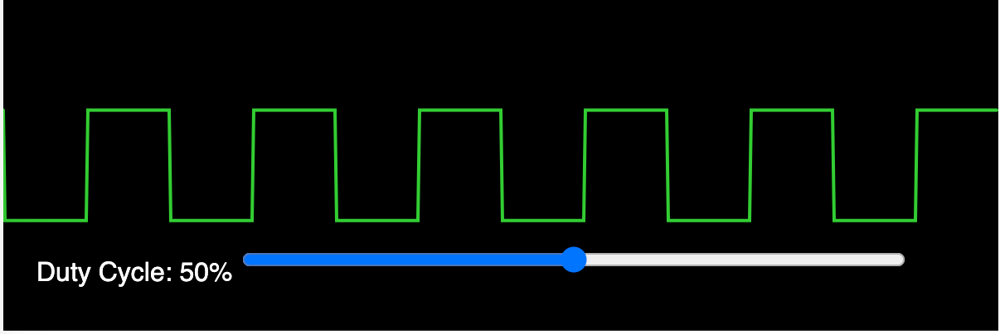

### Pulse-Width Modulation

Pulse-width modulation is the way that microcontrollers send a precise signal to a 
device such as a motor controller.  This simulation models an old CRT oscilloscope display
with a bright green line on a black background.

[Pulse-Width Modulation](./pwm.html)