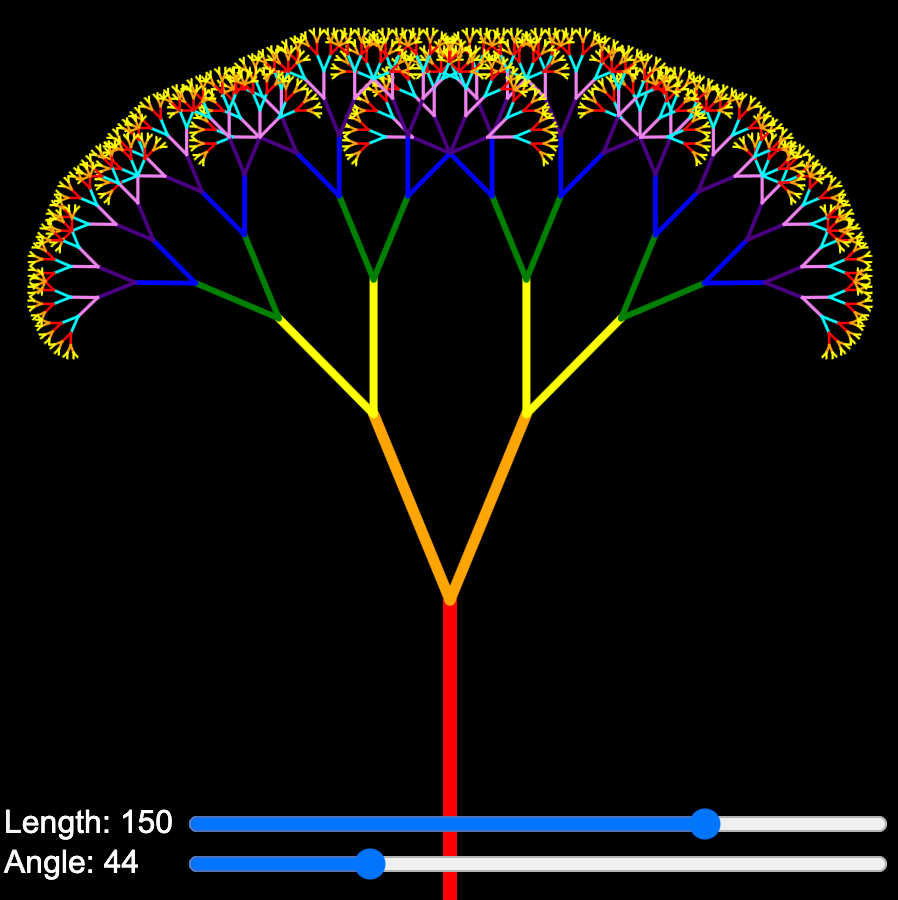

# Rainbow Tree



Generating a fractal tree is a fun way to demonstrate recursion.  This example has two sliders:

1. One changes the length of the branch of a tree
2. The second changes the angle between the branches

## Prompt

```linenums=[0]
Generate a single p5.js sketch.
The sketch will draw a tree using a recursive function.
Start the drawing at the bottom and go up 1/3 of the hight
using the drawTree() function.
Call drawTree() recursivly using two branches that are
1/2 as long as current branch.
```
[Rainbow Tree Demo](./rainbow-tree.html)

## Result

```js
// Create a two branch recursive tree drawing with sliders for length and angle
// Vary the length of the branch to be 0 to 200 with a default of 150
// Vary the angle from 0 to PI/2 with a default of PI/8
let width = 450
let height = 450
let sliderLength, sliderAngle;
let rainbowColors = ['red', 'orange', 'yellow', 'green', 'blue', 'indigo', 'violet', 'cyan'];
// 16 point label and value width for left margin of sliders
let labelWidth = 100;

function setup() {
  const canvas = createCanvas(width, height);
  textSize(16)
  // canvas.parent('canvas-container');

  sliderLength = createSlider(0, 200, 150);
  sliderLength.position(labelWidth, height - 45);
  sliderLength.style('width', width - labelWidth - 10 + 'px');

  sliderAngle = createSlider(0, PI / 2, PI / 8, 0.01);
  sliderAngle.position(labelWidth, height - 25);
  sliderAngle.style('width', width - labelWidth - 10 + 'px');
}

function draw() {
  background('black');
  // move the coordinate system
  
  let len = sliderLength.value();
  let angle = sliderAngle.value();
  // draw the label and values
  fill('white')
  strokeWeight(0)
  text("Length:" + len, 10, height - 30);
  text("Angle:" + int(angle * 115), 10, height - 10);
  strokeWeight(7);
  translate(width/2, height);
  branch(len, angle, 0);
}

function branch(len, angle, depth) {
  stroke(rainbowColors[depth % rainbowColors.length]);
  line(0, 0, 0, -len);
  if (len > 4) {
    push();
    translate(0, -len);
    rotate(angle);
    strokeWeight(map(len, 0, 200, 1, 7));
    branch(0.67 * len, angle, depth + 1);
    rotate(-2 * angle);
    branch(0.67 * len, angle, depth + 1);
    pop();
  }
}
```