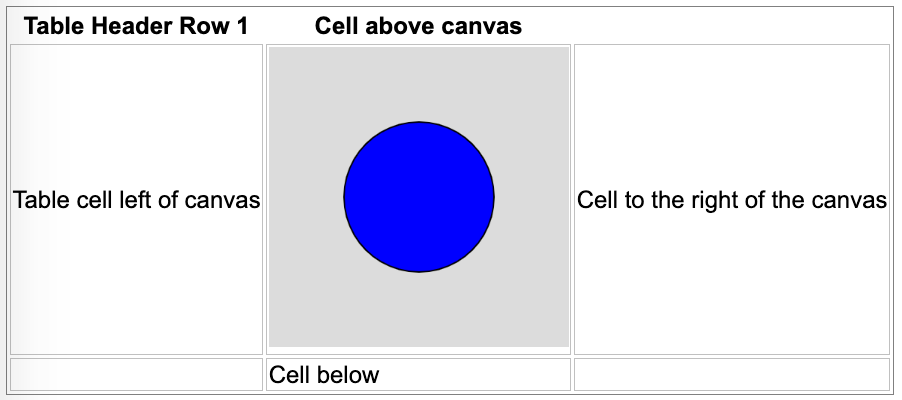

# Structure of a p5.js Sketch

Each sketch (the name of a p5.js program) is usually a single JavaScript file that has an extension of .js.
It has two main functions:

1. ```setup()``` - which is run once on sketch startup.
2. ```draw()``` - which run continually with a default redraw interval of 60 frames per second.

A sketch runs in an area called a ```canvas``` which typically has a size such as 400x400.

## Prompting Tips

My suggestion is to always start your p5.js prompts with a statement such as:

*Generate a single file p5.js sketch on a 400x400 canvas.*


ChatGPT is very good at generating algorithms, but it is not good at doing layout.  This is also compounded
by the fact that many programs are designed to draw on a cartesian coordinate system with the origin being
placed in the lower left corner of a canvas.  Unfortunately, p5.js (like other HTML rendering tools) assumes that the origin is in the upper right corner of the screen.  This causes ChatGPT to get confused and requires us to flip our diagrams on the y-axis by hand.  See [p5.js Coordinates](https://p5js.org/examples/structure-coordinates.html) and [The p5.js Coordinate System and Shapes](https://p5js.org/learn/coordinate-system-and-shapes.html) for some details.

Here are some of my tips.

### Range Control Sliders

{: style="height:300px;width:300px"}

Sliders are the input range controls that allow users to change a value of a simulation.  I use
sliders extensively in my examples because they are visible and intuitive.  To get the sliders to work you need to give ChatGPT clear instructions to include both the slider, its label and its current value in the program.

Note that many p5.js examples don't use sliders, but they use a mouse position on the canvas.  This is
usually a poor design choice since there is no clear hints the simulation us using the values and there
is no label or feedback on what the current value is.

Sliders have the following properties:

1. Their initial position (x and y)
2. Their min and max values
3. The default value
4. The step or increment (default is 1)
5. The width of a slider

See the [p5.js createSlider](https://p5js.org/reference/#/p5/createSlider) page for details.

Unfortunately, there is no simple way to change many of the display details such as drawing the tick marks on a range control and changing the color.

Here are two examples.

#### Simple Slider with Label and Value

Here is some sample text you can give ChatGPT to precisely create and position sliders.

**ChatGPT Prompt:**

```linenums="0"
Add a slider that controls the radius at the bottom of the canvas.
The slider has values that ranges from 0 to 200 with a default
value of 100.
Place the slider to the right of the slider label and value
at the bottom of the canvas.
Place a label of "Radius:" and the current radius value
using text() at the end of the draw() function.
```

Here is the full prompt:

```linenums="0"
Generate a single file p5.js sketch on a 400x400 canvas.

The sketch will draw a blue circle at the center of the canvas.

Add a slider that controls the radius of the circle at the bottom of the canvas.
The slider has values that ranges from 0 to 200 with a default value of 100.
Place the slider at the bottom of the canvas.
Place a label of "Radius:" and the current radius value
using text() at the end of the draw() function.
```

[Demo of Single Slider Radius Example](./slider.html)

### Sketch Container Placement

ChatGPT is not really good at placing graphic components on the screen and placing the canvas so it renders well within an HTML file.  We focus on just getting ChatGPT to generate the correct sketch and then we place
the sketch within an HTML file.  Here is an example of placing a canvas within an HTML table.



To do this, within the ```setup()``` function we can use the ```canvas.parent()``` method to indicate the ID of the enclosing HTML div id.  Here is some sample ```setup()`` code:

```js
function setup() {
  // Create a p5.js canvas inside the div with id "sketch-container"
  const canvas = createCanvas(400, 400);
  canvas.parent('canvas-container');
}
```
