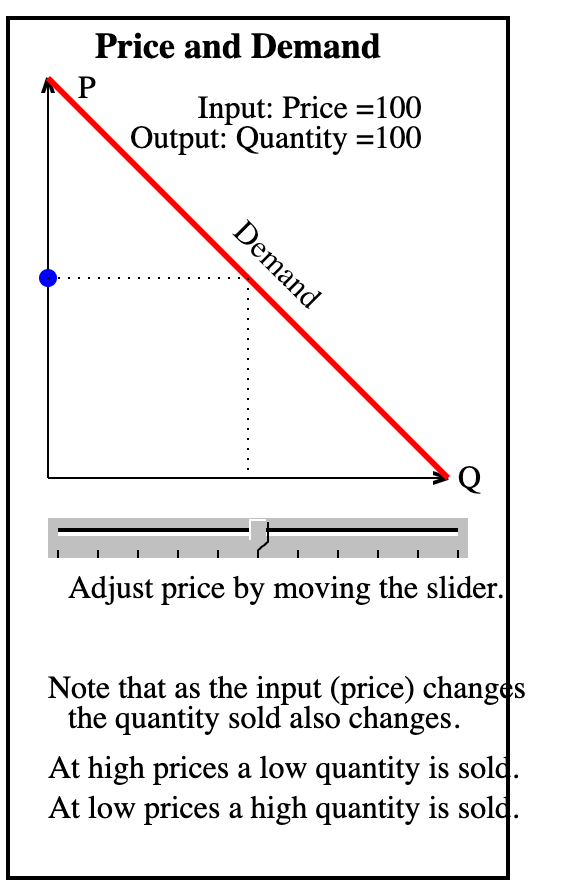

# Supply and Demand

## Prompt


```py
Create a single file p5.js sketch that replicates the function of this image.
```

* [Link to Demo](./supply-and-demand.html)

## Lesson Plan

This is a lesson plan for 10th-grade students in a microeconomics class.
The lesson plan will include objectives, materials, procedure, and assessment for a lab activity using the p5.js sketch.

* **Course:** Microeconomics
* **Grade Level:** 10th Grade
* **Duration:** 45 minutes

### Objectives
- Students will understand the concept of the demand curve.
- Students will learn how changes in price affect the quantity demanded.
- Students will interact with a p5.js sketch to observe these economic principles visually.

### Materials
- Computers with internet access and a web browser.
- Projector to demonstrate the p5.js lab.
- Copies of the demand curve lab worksheet.

### Introduction (5 minutes)
- Begin the lesson with a brief review of supply and demand.
- Introduce the demand curve as a visual representation of the relationship between price and quantity demanded.

### Instruction (10 minutes)
- Explain how the demand curve is typically downward sloping.
- Describe how to read the demand curve.
- Demonstrate the interactive p5.js lab on the projector.

### Activity Procedure (20 minutes)
- Students will access the p5.js sketch on their computers.
- They will manipulate the price slider and observe changes in quantity demanded.
- Students will complete the lab worksheet with questions related to their observations.

### Discussion (5 minutes)
- Regroup and discuss the findings as a class.
- Highlight the key economic principles demonstrated by the lab.

### Assessment (5 minutes)
- Review the lab worksheet answers as a class.
- Provide feedback on their understanding and clear up any misconceptions.

### Extensions
- Students can explore how factors other than price affect the demand curve.
- For homework, students could be asked to draw their own demand curves based on different scenarios.

### Closure
- Summarize the day's lesson and discuss how the demand curve relates to real-world economics.

## Sample Code

The code has several parts:

1. **Global Variables** - allocate memory and set default layout values
2. **setup()** - runs only once
3. **draw()** - continually runs as users change the slider

```js
let width = 400;
let height = 400;
let margin = 50; // side around the plot
let priceSlider;
let demandCurve;
let maxPrice = 200;
let maxQuantity = 200;
let price = 100;
let quantity = 100;
let labelValueMargin = 140

function setup() {
  const canvas = createCanvas(width, height);
  canvas.parent('canvas-container');
  textSize(16);
  
  // Create a slider element for price adjustment
  priceSlider = createSlider(0, maxPrice, price);
  priceSlider.position(labelValueMargin, height - 35);
  priceSlider.style('width', width - labelValueMargin - 20 + 'px');
  
  // Define the demand curve as a function
  demandCurve = (p) => maxQuantity - p;
}

function draw() {
  background(240);
  
  // Update quantity based on the current value of the price slider
  price = priceSlider.value();
  quantity = demandCurve(price);
  
  // Draw the axes
  stroke(0);
  strokeWeight(1);
  line(margin, margin, margin, height - margin); // Vertical Y-axis
  // Horizontal X axis
  line(margin, height - margin, width - margin, height - margin);
  strokeWeight(0);
  text('Price', 30, 40); // Y-axis label
  text('Quantity Sold', width - margin - 70, height - margin - 10); // X-axis label
  
  // Draw the demand curve
  stroke(255, 0, 0);
  strokeWeight(3);
  line(margin, margin, width - margin, height - margin);
  
  // Draw a point on the demand curve based on current price and quantity
  fill(0, 0, 255);
  noStroke();
  x = map(quantity, 0, maxQuantity, margin, height - margin)
  y = map(price, 0, maxPrice, width - margin, margin)
  circle(x,y,10);
  
  stroke('silver');
  line(margin, y, x, y)
  line(x, y, x, height - margin)
  
  fill(0);
  noStroke();
  circle(
    margin, 
    map(price, 0, maxPrice, width - margin, margin), 10);
  
  circle(
    map(quantity, 0, maxQuantity, margin, height - margin), 
    height - margin, 10);
  
  // Text annotations
  noStroke();
  fill(0);
  textSize(16);
  text("Price and Demand Curve", 120, 30);
  text(`Input Price: ${price}`, 10, height - 20);
  
  text(`Output: Quantity = ${quantity}`, 70, 490);
  textSize(12);
  
  // instructions
  let keyMargin = 180;
  text(`Adjust price by moving the slider.`,     keyMargin, margin);
  text(`Note that as the input (price) changes`, keyMargin, margin + 20);
  text(`    the quantity sold also changes.`,    keyMargin, margin + 40);
  text(`At high prices a low quantity is sold.`, keyMargin, margin + 60);
  text(`At low prices a high quantity is sold.`, keyMargin, margin + 80);
}
```
