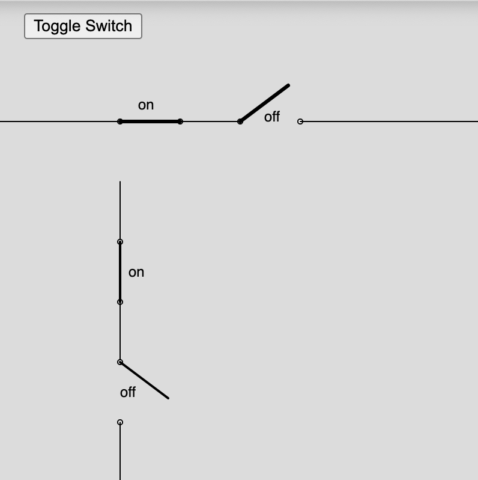

# Draw Switches



In this lab, we create functions that draw switches.  The switches have
a state of "on" (closed) or "off" (open).  There are two versions:

1. drawSwitchHoriz(x, y, w, isClosed) - for drawing a horizontal switch
2. drawSwitchVert(x, y, w, isClosed) - for drawing a vertical swich

[Demo of Switch Drawing](./switch.html)

## Full Test

```js
// draw switches on off horiz and vert

let topLine = 100;
let leftLine = 100;

function setup() {
  noLoop();
  const canvas = createCanvas(400, 400);
  background(220);
  
  
  hline(0, topLine, 100);
  // closed - on - 1
  drawSwitchHoriz(100, topLine, 50, 1);
  hline(150, topLine, 50);
  
  // open - off - 0
  drawSwitchHoriz(200, topLine, 50, 0);
  hline(250, topLine, 150);
  
  
  vline(leftLine, 150, 50);
  // on
  drawSwitchVert(leftLine, 200, 50, 1);
  vline(leftLine, 250, 50);
  // off
  drawSwitchVert(leftLine, 300, 50, 0);
  vline(leftLine, 350, 50);
  
}

function draw() {
  background(220);
  
  hline(0, topLine, 100);
  // closed - on - 1
  drawSwitchHoriz(100, topLine, 50, isSwitchClosed ? 1 : 0);
  hline(150, topLine, 50);
  drawSwitchHoriz(200, topLine, 50, isSwitchClosed ? 0 : 1);
  hline(250, topLine, 400);
  
  vline(leftLine, 150, 50);
  // on
  drawSwitchVert(leftLine, 200, 50, isSwitchClosed ? 1 : 0);
  vline(leftLine, 250, 50);
  drawSwitchVert(leftLine, 300, 50, isSwitchClosed ? 0 : 1);
  vline(leftLine, 350, 50);
}

function hline(x,y,w) {
  strokeWeight(1);
  line(x, y, x+w, y);
}

function vline(x,y,w) {
  strokeWeight(1);
  line(x, y, x, y+w);
}

function drawSwitchHoriz(x, y, w, isClosed) {
  circle(x, y, 3)
  circle(x+w, y, 3)
  stroke(0);
  strokeWeight(3);
  if(isClosed) {
    line(x, y, x + w, y);
    strokeWeight(0);
    text('on',x+10,y-20)
  } else {
    line(x, y, x + w*.8, y - w*.6);
    strokeWeight(0);
    text('off',x+20,y)
  }
}

function drawSwitchVert(x, y, w, isClosed) {
  circle(x, y, 3)
  circle(x, y+w, 3)
  stroke(0);
  strokeWeight(2);
  if(isClosed) {
    line(x, y, x, y + w);
  } else { 
    line(x, y, x + w*.8, y + w*.6);
  }
}
```