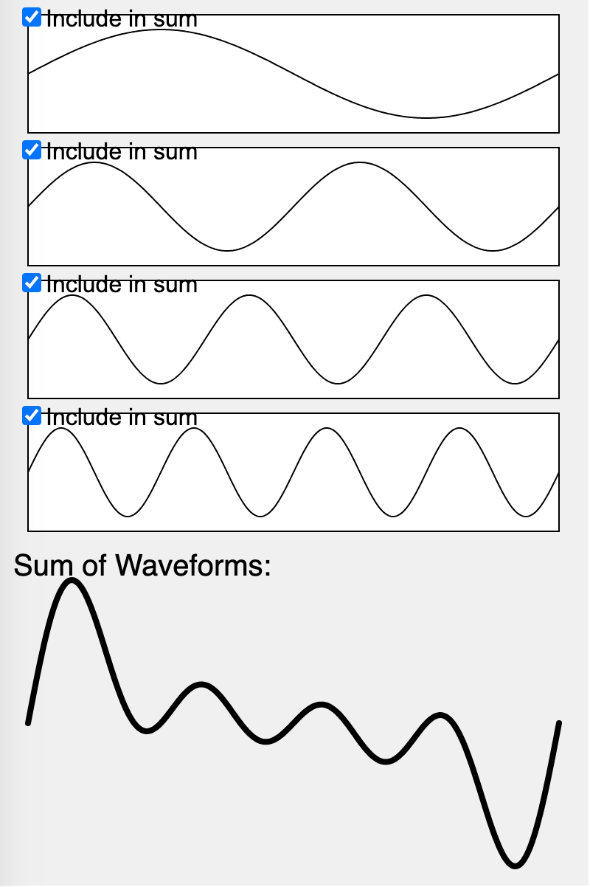

## Wave Sums

This lab demonstrates calculating the sum of sine waves of different lengths.
Understanding how to convert waves from spacial domains into frequency
domains is a key component of signal processing and understanding the FFT
algorithm for doing Fast-Fourier Transforms.

[Wave Sums Demo](./wave-sums.html)