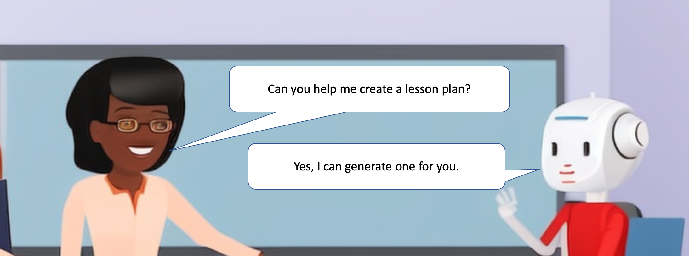

# ChatGPT for Teachers

This is a course to help teachers use ChatGPT to generate content for their classrooms.  It is designed to be useful for a broad audience and we include an extensive [glossary](glossary.md) for people that are new to the field of [generative text](#generative-text).

## Outline of Course

1. **Part 1:** Introduction to ChatGPT?
    1. Ethics: When can we use generative AI?
    2. What is ChatGPT and generative AI
    3. Legal and ethical issues
    4. When to use generative AI vs. finding pre-tested resources
2. **Part 2:** Key Concepts
    1. Prompts and responses
    2. Tokens (with lab)
    3. Temperature and Randomness
    4. Markdown, graph and chart formats
    5. In-Context learning 
3. **Part 3:** Prompt design
    1. Making prompts clear
    2. Giving context
    3. Refining prompts
    4. Audience: tuning to a grade level
    5. Perspective: take a historical perspective
    6. Generating analogies and metaphors
4. **Part 4:** Intermediate Prompts
    1. Syllabus
    2. Code of Conduct
    3. Selecting a License
5. **Part 5:** Advanced Topics
    1. Minimize Costs
    2. Fine-tuning
    3. Embeddings
 6. **Part 6** The Future of AI
    1. AI today - the limits of large-language-models
    2. AI in the next 10 years
    3. AI in the long-term - regulation and existential risks

This course was originally created to help instructors generate lesson plans for teaching computational thinking.