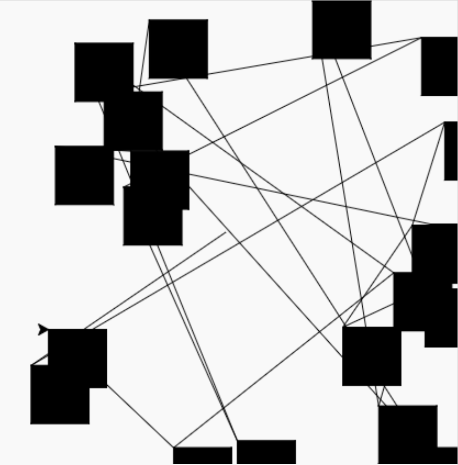

# Turtle Graphics

We can use ChatGPT to generate turtle graphics code and then use [trinket.io](http://trinket.io) 
to execute the code.  Trinket is a free kid-safe website that runs you turtle graphs programs.

In these labs, we will use ChatGPT to generate Python code and then we can copy
the code and paste it into Trinket to test the drawing of the code.  You might want to
create your own account in trinket so you can save your work.  We will
be using the older (free) Python (not Python 3) for our labs.

With turtle graphics, we usually draw on
a standard screen that is 400x400 in size and the point (0,0) is in the middle of the screen
so that ```forward(100)``` will move about 1/4 the length of the screen.

When we need to turn a turtle, we need to give
it a command such as ```right(90)``` that tells it to take a 90-degree right turn.
We need 360 degrees to make a turtle turn fully around.

The sample code on this page has a small "copy code" icon in the upper right corner of the screen.
You can use this to copy the prompts into ChatGPT and the code into Trinket.

## Draw a Square

### Draw Square Prompt

We need to tell ChatGPT to use the Python turtle library.

```
Use the Python turtle library to draw a square.
```

### Response

```python
# GPT Prompt: Use the Python turtle library to draw a square.
import turtle

# Create a turtle object
t = turtle.Turtle()

# Move the turtle forward by 100 pixels
t.forward(100)

# Turn the turtle 90 degrees to the right
t.right(90)

# Move the turtle forward by 100 pixels
t.forward(100)

# Turn the turtle 90 degrees to the right
t.right(90)

# Move the turtle forward by 100 pixels
t.forward(100)

# Turn the turtle 90 degrees to the right
t.right(90)

# Move the turtle forward by 100 pixels
t.forward(100)

# Turn the turtle 90 degrees to the right
t.right(90)
```


[Watch the turtle draw on Trinket.io](https://trinket.io/library/trinkets/a8d83baa81)

!!! Challenges
    1. Can you ask ChatGPT to change the name of your turtle?

    2. Can you ask ChatGPT to use a for loop to draw the square?

    3. Can you ask ChatGPT to draw a square with a specific size and starting location?

    4. What other patterns can you draw?  Can you generate a triangle, a circle, a hexagon,
    an octagon and a five-pointed star?

We learned that just by using a few functions such as ```forward()``` and ```right()``` that we can create
some cool drawings!

## Random Squares

Let's start with a simple program that draws a bunch of random squares on the screen.

### Random Squares Prompt #1

```
Use the Python turtle library to draw a set squares that are
filled in with random colors.
Place the squares randomly on the page.
```

### Response

```python
import turtle
import random

# Create a turtle object
t = turtle.Turtle()

# Set the turtle speed
t.speed(0)

# Create a loop to draw the squares
for i in range(20):
    # Set the random color to be a decimal number from 0 to 1
    t.fillcolor(random.random(), random.random(), random.random())
    # Begin filling the square
    t.begin_fill()
    # Move the turtle to a random position
    t.penup()
    t.goto(random.randint(-200, 200), random.randint(-200, 200))
    t.pendown()
    # Draw the square
    for j in range(4):
        t.forward(50)
        t.right(90)
    # End filling the square
    t.end_fill()

# Keep the window open
turtle.done()
```



[Run Random Squares (black) on Trinket](https://trinket.io/library/trinkets/62bafe5b6b)

There are some cool things that ChatGPT just "knows".  It knows that humans like to see about
20 items on a screen and that a reasonable size of screen is about 400x400 with (0,0) being
right in the middle of the screen.

This program kind of works.  But all the squares are filled with black!  Not very colorful.
Now lets take a look at what went wrong and how we can give ChatGPT a little hint
at how to create better code for us.

### Fixing the Prompt

As a background, there are two different "standards" for drawing color levels.  One sets the color level in
a range of 0 to 1.  The drawing library within Trinket uses a color range of 0 to 255.  But we didn't tell ChatGPT
we were using the 0 to 255 standard so the following lines:

```python
# Set the random color
t.fillcolor(random.random(), random.random(), random.random())
```

The function ```random.random()``` generates a random decimal number from 0 to 1

are not correct for Trinket.  Here is the correct version:

```python
# Set the random colors as r,g,b values that are integers from 0 to 255
t.fillcolor(random.randint(0, 255), random.randint(0, 255), random.randint(0, 255))
```

We could manually fix this by scaling the colors by 255.  But that means
that we would have to also fix all the other code we generate.  How can we tell ChatGPT
that we need our color ranges in the range of 0 to 255?  The answer is we just add
one additional sentence to the prompt.

"Use a color range of 0 to 255."

Here is the new prompt:
```
Use the Python turtle library to draw a
set squares that are filled in with random colors.
Place the squares randomly on the page.
Use a color range of 0 to 255.
```

## Forcing a Function

The program above is nice, but it hard to read and hard to figure out where the logic of the square drawing starts and stops.  What if we wanted to write a program that draws both squares and circles at random locations.

The answer is to force ChatGPT to create a function that draws the squares.
We will need to modify the prompt to explicitly ask ChatGPT to create a
draw_square() function and tell it to use color, x and y as input
parameters.

### Force Function Prompt

```
Use the Python turtle library to draw a squares of different
colors at random locations.  Create a function called draw_square
that has inputs of color, x and y.  Make sure to begin the fill
and end the fill and remember that colors range from 0 to 255.
```

### Force Function Response

```
import turtle
import random

def draw_square(color, x, y):
    turtle.penup()
    turtle.goto(x, y)
    turtle.pendown()
    turtle.fillcolor(color)
    turtle.begin_fill()
    for i in range(4):
        turtle.forward(50)
        turtle.right(90)
    turtle.end_fill()

for i in range(10):
    r = random.randint(0, 255)
    g = random.randint(0, 255)
    b = random.randint(0, 255)
    x = random.randint(-200, 200)
    y = random.randint(-200, 200)
    draw_square((r, g, b), x, y)

turtle.done()
```


[Random Squares on Trinket](https://trinket.io/library/trinkets/4c45c68256)

!!! Challenge
    Ask ChatGPT to create new functions for drawing triangles, circles, hexagons and stars.