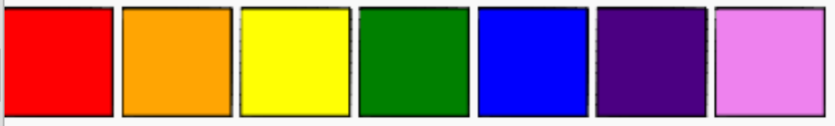

# Rainbow Boxes

## Initial Prompt

```linenums="0"
Generate a sample python program using the turtle library that will
draw 7 boxes filled with the colors of the rainbow.  
```

## Prompt

```linenums="0"
Generate a sample python program using the turtle library that will draw 
7 boxes filled with the colors of the rainbow.  Start at (-200,0) and 
make the boxes 50 on each side. Space the boxes 55 apart.
Don't bother with the setup including screen size, background color and title.
```

## Results

```python
import turtle

# Create the turtle object and name it "t"
t = turtle.Turtle()
t.penup()
t.goto(-200, 0)

# Define the colors of the rainbow
colors = ["red", "orange", "yellow", "green", "blue", "indigo", "violet"]

# Loop through the colors and draw a box for each one
for i in range(7):
    t.fillcolor(colors[i])
    t.begin_fill()
    for j in range(4):
        t.forward(50)
        t.right(90)
    t.end_fill()
    t.penup()
    t.forward(55)
    t.pendown()

# Hide the turtle cursor when done
t.hideturtle()
```

This program sets up a turtle screen with a white background and a title of "Rainbow Boxes". It defines a list of colors representing the colors of the rainbow, and then loops through each color, drawing a box and filling it with the corresponding color. It uses the turtle library's fillcolor, begin_fill, end_fill, penup, and pendown functions to draw the boxes, and it spaces them out using a forward movement of 30 pixels between each box. Finally, it hides the turtle cursor and waits for the user to close the window.

## Notes

Some Python turtle libraries require screen setup like this:

```py
# Set up the turtle screen
turtle.setup(500, 500)
turtle.bgcolor("white")
turtle.title("Rainbow Boxes")
```

You can remove these lines.

## Rendering



[Link To Demo on Tinket](https://trinket.io/library/trinkets/847bde9236)