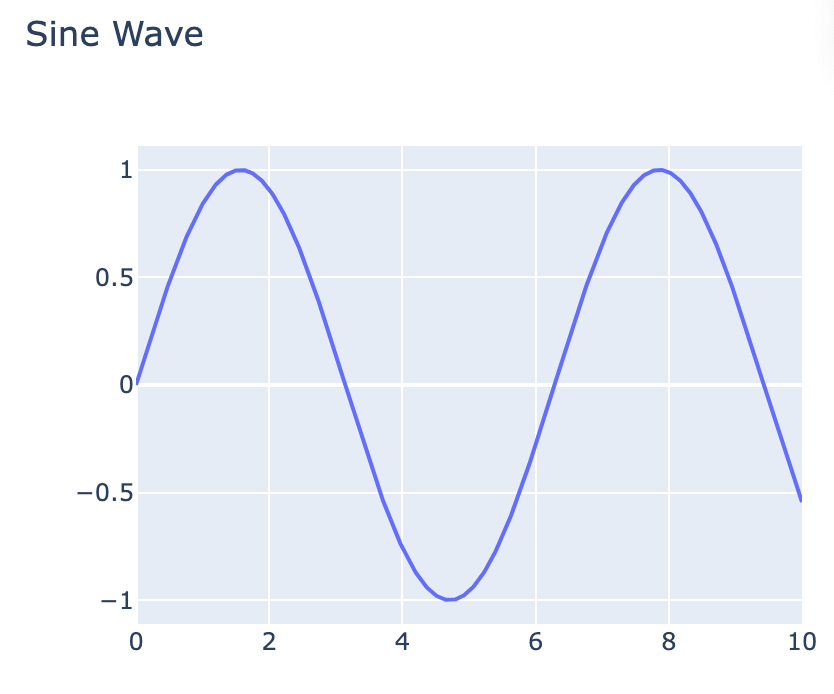
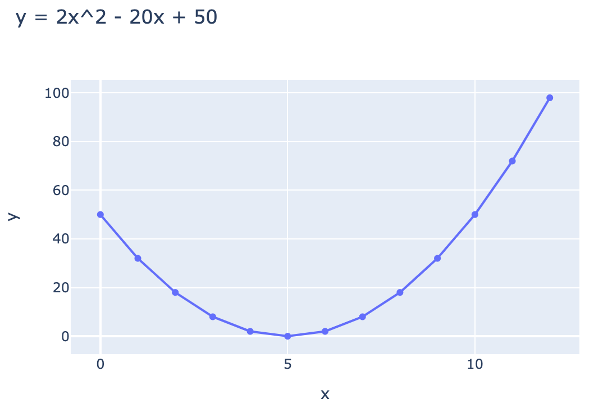

# Charts

You can give GPT a set of points and have it generate the Python code to plot the points.

## Bar Chart

### Prompt
```
Create a Python plotly program to draw a vertical bar chart showing the area of all the continents.
```

### Response

```python
# Data
labels = ['Africa', 'Antarctica', 'Asia', 'Australia', 'Europe', 'North America', 'South America']
values = [30.37, 14.2, 44.6, 8.5, 10.2, 24.2, 17.8]

# Create figure
fig = go.Figure(data=[go.Bar(
    x=labels,
    y=values,
    text=values,
    textposition='auto',
    marker_color='#FFA500'
)])

# Change the bar mode
fig.update_layout(barmode='stack')

# Add title
fig.update_layout(title_text='Area of Continents')

# Show figure
fig.show()
```


Note the area is million of square miles.

## Prompt
```
Create a Python program to draw a sine wave using Plotly.
```

## Response

```python
import plotly.graph_objects as go
import numpy as np

# Generate data
x = np.linspace(0, 10, 1000)
y = np.sin(x)

# Create figure
fig = go.Figure()

# Add trace
fig.add_trace(go.Scatter(x=x, y=y, mode='lines', name='sin(x)'))

# Set title
fig.update_layout(title_text='Sine Wave')

# Show figure
fig.show()
```



## Plot a Polynomual

### Prompt

```
Create a Python program to draw a plot of the function y =2x^2 - 20x + 50 from x=0 to 13 using plotly
```

### Response
```py
import plotly.graph_objects as go

x = list(range(0, 13))
y = []
for i in x:
    y.append(2*i*i - 20*i + 50)
print(y)

fig = go.Figure()
fig.add_trace(go.Scatter(x=x, y=y, mode='lines+markers'))
fig.update_layout(title='y = 2x^2 - 20x + 50', xaxis_title='x', yaxis_title='y')
fig.show()
```



## Bar Chart

Create a Python plotly program to draw a vertical bar chart showing the area of all the contanents


```py
import plotly.graph_objects as go

# Data
labels = ['Africa', 'Antarctica', 'Asia', 'Australia', 'Europe', 'North America', 'South America']
values = [30.37, 14.2, 44.6, 8.5, 10.2, 24.2, 17.8]

# Create figure
fig = go.Figure(data=[go.Bar(
    x=labels,
    y=values,
    text=values,
    textposition='auto',
    marker_color='#FFA500'
)])

# Change the bar mode
fig.update_layout(barmode='stack')

# Add title
fig.update_layout(title_text='Area of Continents')

# Show figure
fig.show()