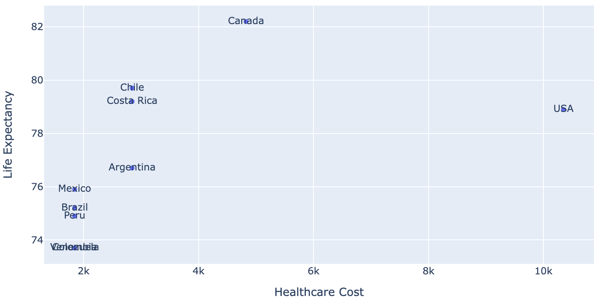

# Scatter Plots

## Prompt

```
Create a Python program that does a scatter plot.  
For each country place a point on the plot.  
For the x-axis make it be the average life expectancy.  
For the y-axis make it be the annual cost of healthcare.
```

```py
import matplotlib.pyplot as plt
import pandas as pd

# Assume you have a dataframe "df" that contains the columns "Country", "Life Expectancy" and "Healthcare Cost"

plt.scatter(df['Life Expectancy'], df['Healthcare Cost'])
plt.xlabel('Life Expectancy')
plt.ylabel('Healthcare Cost')
plt.title('Scatter plot of Life Expectancy vs Healthcare Cost')

for i, txt in enumerate(df['Country']):
    plt.annotate(txt, (df['Life Expectancy'][i], df['Healthcare Cost'][i]))

plt.show()
```

The above code will create a scatter plot with each country represented as a point, with the x-axis being the average life expectancy and the y-axis being the annual cost of healthcare. Additionally, each point is labeled with the country name.
Please note that you will need to have the dataframe with the 3 columns i.e "Country", "Life Expectancy" and "Healthcare Cost" and replace the 'df' with the actual dataframe name in the code.

## Prompt #2
Create a pandas dataframe that includes the names of countries in the americas, the average life expectancy, and the average annual healthcare cost.

```py
import pandas as pd

# Create a dictionary containing the data
data = {'Country': ['Canada', 'United States', 'Mexico', 'Brazil', 'Argentina', 'Colombia'],
        'Life Expectancy': [81.2, 78.9, 75.5, 74.9, 75.3, 73.5],
        'Healthcare Cost': [5200, 9500, 1000, 800, 1500, 600]}

# Create a DataFrame from the dictionary
df = pd.DataFrame(data)

# Print the DataFrame
print(df)
```

```
      Country  Life Expectancy  Healthcare Cost
0         USA             78.9            10348
1      Canada             82.2             4826
2      Mexico             75.9             1845
3      Brazil             75.2             1845
4       Chile             79.7             2845
5        Peru             74.9             1845
6   Argentina             76.7             2845
7    Colombia             73.7             1845
8   Venezuela             73.7             1845
9  Costa Rica             79.2             2845
```


