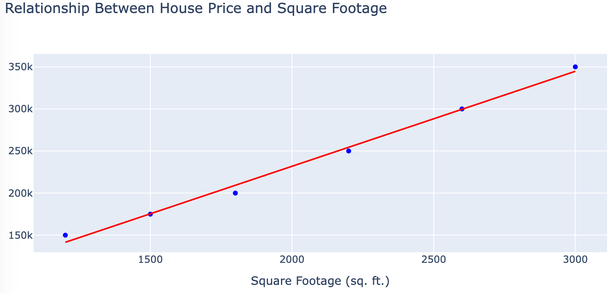

# Linear Regression

Linear regression is a way to find a line that goes through some points on a graph.

## Use a Metaphor
**Prompt:** Use a metaphor to explain linear regression.

Linear regression can be metaphorically compared to fitting a straight line through a scatterplot of data points. Just like how a tailor takes a piece of cloth and cuts and stitches it to fit a person's body, linear regression takes a set of data points and calculates the best-fit line that describes the relationship between two variables. The line acts as a measuring tape that stretches across the data points, revealing the patterns and trends hidden within. And just as a tailor may need to make adjustments to get the perfect fit, linear regression can be fine-tuned to accurately capture the nuances of the data.

## Examples of Linear Regression

For example, let's say you wanted to see if there is a relationship between the amount of time you spend studying and the grade you get on a test. You could collect data on how long you study and what grade you get on each test, then plot that data on a graph. Linear regression would help you find a line that best fits the points on the graph, which would help you see if there's a pattern or trend in the data.

In everyday life, linear regression is used to make predictions about things. For example, if you're a farmer and you want to know how much corn you're likely to harvest based on how much fertilizer you use, you could use linear regression to find a line that best fits the data you collect on how much fertilizer you use and how much corn you harvest. Then, you could use that line to predict how much corn you're likely to harvest if you use a certain amount of fertilizer.

Another example could be if a company wants to predict how much money it will make in the future based on its current revenue, it could use linear regression to find a line that best fits its revenue data. Then, they could use that line to predict how much money they will make in the future based on their projected revenue.

Here is a sample dataset for linear regression that shows the price of houses based on their square footage:

|Square Footage|Price of House (in $)|
|--------------|---------------------|
|1,200|	150,000|
|1,500|	175,000|
|1,800|	200,000|
|2,200|	250,000|
|2,600|	300,000|
|3,000|	350,000|

To create a formula that predicts the price of a house based on its square footage, we can again use linear regression.

First, we need to plot the data points on a graph with the square footage on the x-axis and the price of the house on the y-axis. We can see from the data that there appears to be a positive correlation between the square footage and the price of the house.

Next, we can use a linear regression calculator or software to find the equation of the line of best fit for the data points. This line will have the form of ```y = mx + b```, where y is the price of the house, x is the square footage, m is the slope of the line, and b is the y-intercept.

Using the sample dataset, the equation of the line of best fit would be: y = 83.33x - 10,000

This means that for every additional square footage of the house, the price of the house increases by $83.33, and the initial price of the house (when x=0) is -$10,000, which is not realistic, so we can ignore the y-intercept in this case.

So if you wanted to predict the price of a new house with a square footage of 2500 sq. ft., you could use the formula:

y = 83.33(2500) - 10,000

y = 208,325

This predicts that the price of the house with a square footage of 2500 sq. ft. would be $208,325. However, it's important to note that this is just a prediction based on the data we have, and there may be other factors that affect the price of a house beyond its square footage, such as location, age, number of bedrooms/bathrooms, and more.

```py
import plotly.graph_objects as go
import numpy as np

# create data
sq_ft = np.array([1200, 1500, 1800, 2200, 2600, 3000])
price = np.array([150000, 175000, 200000, 250000, 300000, 350000])

# calculate line of best fit
m, b = np.polyfit(sq_ft, price, 1)
line = m * sq_ft + b

# create plotly chart
fig = go.Figure()

# add data points
fig.add_trace(go.Scatter(x=sq_ft, y=price, mode='markers', marker=dict(color='blue')))

# add line of best fit
fig.add_trace(go.Scatter(x=sq_ft, y=line, mode='lines', line=dict(color='red')))

# set axis labels and title
fig.update_layout(title='Relationship Between House Price and Square Footage',
                   xaxis_title='Square Footage (sq. ft.)',
                   yaxis_title='Price of House ($)')

fig.show()
```



## Story Telling

### Prompt

Create a story about a student learning linear regression as it would be told by Joseph Campbell.

### Response

Once upon a time, there was a young student named Alex who was studying data science at a prestigious university. Alex had a burning passion for understanding the patterns and relationships hidden within data, and spent countless hours poring over statistical models and data sets.

One day, Alex was introduced to the concept of linear regression, a powerful tool for modeling relationships between variables. At first, Alex was overwhelmed by the complexity of this new concept, but soon felt a stirring within themselves - a call to adventure.

As Alex delved deeper into the world of linear regression, they encountered challenges and obstacles that tested their resolve. There were equations to solve and models to build, and at times it seemed as though the path ahead was shrouded in darkness.

But Alex persisted, driven by a sense of purpose and a desire to unlock the secrets hidden within the data. Along the way, they met mentors and fellow travelers who offered guidance and wisdom, and together they journeyed through the mysterious and often treacherous realm of linear regression.

As Alex approached the final stages of their quest, they found themselves faced with a daunting task: to apply their newfound knowledge to a real-world problem and deliver a solution that would make a difference in the lives of others.

With steely determination and unwavering focus, Alex forged ahead, drawing upon all the skills and insights they had gained throughout their journey. And in the end, their efforts were rewarded: the model they created was hailed as a breakthrough, and Alex emerged as a hero, having successfully navigated the perils of linear regression and emerged victorious.

From that day forward, Alex was known not just as a student of data science, but as a hero of linear regression - a brave adventurer who had journeyed into the unknown and emerged triumphant. And the lessons they had learned along the way would stay with them always, guiding them on future quests and adventures yet to come.

## Using Analogies

**Prompt:** Can you use an analogy that includes springs used to adjust the distance from points to a line?

**Response:** Sure, here's an analogy that includes springs used to adjust the distance from points to a line in linear regression:

Imagine you have a set of points suspended by springs above a line. The springs can be adjusted to move the points closer or farther away from the line. The goal is to adjust the springs in such a way that the points are as close as possible to the line.

In this analogy, the line represents the linear model that we are trying to fit to the data, and the points represent the actual data points. The springs represent the coefficients of the model that we adjust to minimize the distance between the data points and the line.

We can think of the distance between each point and the line as the tension in the spring connecting the point to the line. Our goal is to adjust the springs (i.e., the coefficients) in such a way that the tension in each spring is minimized, or in other words, the distance between the point and the line is minimized.

Through the process of linear regression, we adjust the coefficients (i.e., the springs) until we have the best possible fit between the data points and the line. This fit allows us to make predictions about the dependent variable (the points) based on the independent variable (the line).

## Generate JavaScript SVG demo

We can now ask ChatGPT to generate an interactive JavaScript Demo:

[Linear Regression Demo with JavaScript and SVG](../demos/linear-regression.html)

[Linear Regression with Grid Lines](../demos/grid-lines.html)

[Sliders](../demos/slider.html)