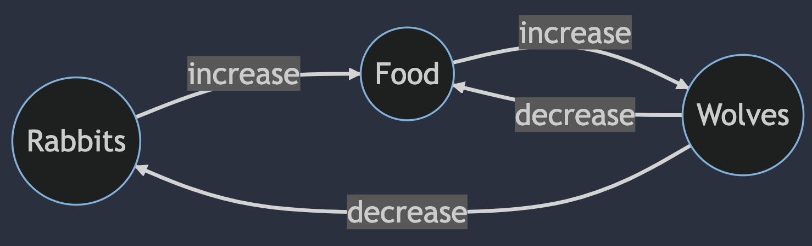
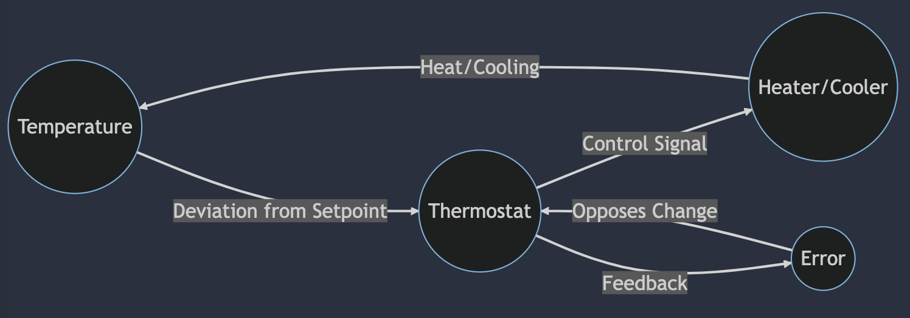

# System Thinking

## Prompt

```linenums="0"
Create a causal loop diagram to illustrate the population of rabbits and wolves in mermaid dependancy graph format.
```

## Response

```
graph LR
A((Rabbits)) -->|increase| B((Food))
B -->|increase| C((Wolves))
C -->|decrease| A
C -->|decrease| B
```

## Render on Mermaid.live



## Thermostat

```linenums="0"
Create a balancing causal loop diagram for a thermostat using mermaid causal diagram markup format.
```

```
graph LR
A((Temperature)) -->|Deviation from Setpoint| B((Thermostat))
B -->|Control Signal| C((Heater/Cooler))
C -->|Heat/Cooling| A
B -->|Feedback| D((Error))
D -->|Opposes Change| B
```


