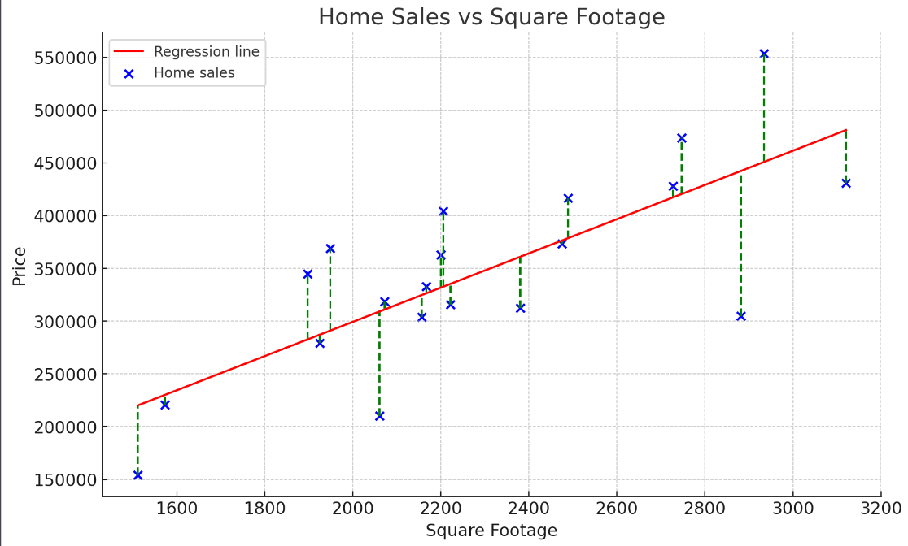

# Regression Line

Prompt
```linenums="0"
Create and run a Python program that creates a scatter plot of sample home sales.  
The vertical axis should be the price of the home and the horizontal axis should 
be the square footage of the home.  Generate synthetic home sales for 20 homes.  
Add a regression fit line and draw a vertical line between the regression line 
and each point that represents a home sale.
```




```python
import numpy as np
import matplotlib.pyplot as plt
from sklearn.linear_model import LinearRegression

# Generate synthetic home sales data
np.random.seed(0)  # for reproducibility
square_footage = np.random.normal(2000, 500, 20)  # normal distribution around 2000 sqft with std dev of 500
prices = square_footage * 150 + np.random.normal(0, 50000, 20)  # price is $150 per sqft plus some noise

# Fit a linear regression model
model = LinearRegression()
model.fit(square_footage.reshape(-1, 1), prices)

# Generate regression line points
x_reg = np.linspace(square_footage.min(), square_footage.max(), 100)
y_reg = model.predict(x_reg.reshape(-1, 1))

# Plot the points
plt.scatter(square_footage, prices, color='blue', label='Home sales')
plt.plot(x_reg, y_reg, color='red', label='Regression line')

# Draw vertical lines from the points to the regression line
for sqft, price in zip(square_footage, prices):
    reg_price = model.predict(np.array([[sqft]]))
    plt.vlines(sqft, min(price, reg_price), max(price, reg_price), linestyles='dashed', colors='green')

plt.xlabel('Square Footage')
plt.ylabel('Price')
plt.title('Home Sales vs Square Footage')
plt.legend()
plt.grid(True)
plt.show()
```
